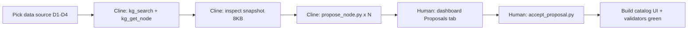

# 00 — Workshop workflow (operator + attendee)

**Last updated**: 2026-05-31  
**Status**: W4 attendee docs shipped (`01` / `02` / `03`); operators use full checklist below  
**Audience**: operators now; attendees after W3 starter repo ships

## One-line goal

Attendee leaves with a **validators-green catalog** built via **Cline + MCP + dashboard human review**, using the same propose-review protocol as D1–D4.

## Standard stack (locked)

| Layer | Component | Who sets it up |
|---|---|---|
| Python | **Repo `.venv`** (not system Python) | Human (once per clone) |
| IDE | VS Code + Cline (left panel) | Human |
| Agent rules | `.clinerules/` | Shipped in repo (W1) |
| Agent KG read | MCP `agentloom-kg` → `.venv` python | Human configures `cline_mcp_settings.json` (W2) |
| Human KG review | Dashboard `:8000` | Human runs `make dashboard` |
| Mutations | `propose_node.py` / `accept_proposal.py` | Cline proposes; human accepts |

**Cline does not configure MCP for you.** Operator pastes MCP JSON once. After that, Cline uses the tools.

---

## Phase A — Bootstrap (human, ~10 min)

Run from repo root (`ucgis-agentloom-2026` or workshop fork):

```bash
# Windows (VS Code integrated terminal)
python -m venv .venv
.venv/Scripts/pip install -r requirements.txt
.venv/Scripts/python scripts/test_mcp_kg_tools.py    # expect PASS
.venv/Scripts/python scripts/kg/propose_node.py --help
```

```bash
# macOS / Linux
python3 -m venv .venv
.venv/bin/pip install -r requirements.txt
.venv/bin/python scripts/test_mcp_kg_tools.py    # expect PASS
.venv/bin/python scripts/kg/propose_node.py --help
```

Set VS Code interpreter → **Python: Select Interpreter** → `.venv/Scripts/python.exe` (Windows) or `.venv/bin/python`.

Copy `.vscode/settings.json.example` → `.vscode/settings.json` if present (optional; helps Cline shell commands use venv).

---

## Phase B — Cline LLM (human, ~5 min)

1. Install Cline (`saoudrizwan.claude-dev`)
2. `Ctrl+Shift+P` → **Cline: Settings**
3. Provider: OpenAI (workshop: OpenAI Compatible + pooled proxy)
4. Model: `gpt-5.2`, Temperature: `0.2`
5. Sanity check: ask Cline to read first 200 chars of `.clinerules/01-builder-agent-prompt.md`

Details: [`cline-wrapper.md`](./cline-wrapper.md) · [`09-cline-setup.md`](../../../envistor-data/docs/research/workshop-ucgis-2026/09-cline-setup.md) (envistor copy)

---

## Phase C — MCP server (human, ~5 min)

1. Cline panel → **MCP Servers** → Configure → **Configure MCP Servers**
2. Paste config from [`cline-mcp-settings.example.json`](./cline-mcp-settings.example.json) (Windows) or [`cline-mcp-settings.macos-linux.example.json`](./cline-mcp-settings.macos-linux.example.json) (macOS/Linux)
3. Replace `REPO_ROOT` with your **absolute fork path** (must match the clone you have open)
4. Save → Done → **Developer: Reload Window**
5. Confirm **agentloom-kg** connected (green). Tool names may not appear ([cline#1272](https://github.com/cline/cline/issues/1272)) — use Phase E functional test.

**Cline MCP config is global** (one JSON for all VS Code projects) — switch paths when you change clones. See [`01-setup.md`](./01-setup.md) Step 5b.

**MCP `command` must be `.venv/Scripts/python.exe`** (Windows) or `.venv/bin/python` — not system Python.

Details: [`cline-mcp-tools.md`](./cline-mcp-tools.md)

---

## Phase D — Dashboard (human, ~2 min)

Terminal 1 (keep running during workshop):

```bash
# Windows — dedicated terminal tab; omit --reload on Windows if the process exits immediately
.venv/Scripts/python -m uvicorn server.dashboard.app:app --port 8000 --host 127.0.0.1

# macOS / Linux
.venv/bin/python -m uvicorn server.dashboard.app:app --port 8000 --host 127.0.0.1

# or, on any platform with make:
make dashboard
```

Browser: `http://127.0.0.1:8000` → **Proposals** tab for human review.

Open [`welcome.html`](./welcome.html) in browser as onboarding cheat sheet.

---

## Phase E — Cline acceptance smoke test (Cline, ~5 min)

New Cline task (left panel):

```
Use MCP kg_search for "catalog storytelling" with role=builder.
Use MCP kg_list_proposals.
Do NOT read agents/knowledge-graphs/*-graph.json directly.
Report hit counts and stop.
```

Pass: MCP tools invoked; builder search ≥1 hit; proposals count reported (0 on cold fork OK).

Pass: MCP tools invoked; domain ISO3166 hit (may be `pending_proposal`); proposal count reported.

Save transcript → `runs/agent/` (see W1 Wave C convention).

---

## Phase F — Workshop main loop (attendee + Cline)



Per iteration:

1. **Cline** searches KG (`kg_search`) and reads conventions (`kg_get_node`)
2. **Cline** proposes via `propose_node.py` — stops without accept
3. **Human** reviews on dashboard Proposals tab
4. **Human** runs `accept_proposal.py` if satisfied
5. **Cline** implements catalog / skills / validators; `run_all.py` must PASS before commit

---

## Phase G — Commit discipline

- Paired-commit hard-launch: every commit validators-green
- Cline never calls `accept_proposal.py`
- MCP read-only; only CLIs mutate KG

---

## Checklist (printable)

| # | Step | Pass? |
|---|---|---|
| A1 | `.venv` created + `pip install -r requirements.txt` | ☐ |
| A2 | `test_mcp_kg_tools.py` → PASS | ☐ |
| A3 | VS Code interpreter = `.venv` | ☐ |
| B1 | Cline installed + API configured | ☐ |
| B2 | `.clinerules` sanity check | ☐ |
| C1 | MCP `agentloom-kg` connected (green) | ☐ |
| C2 | MCP functional test — Cline calls `kg_search` in chat | ☐ |
| C3 | MCP uses `.venv` python path | ☐ |
| D1 | Dashboard `:8000` Proposals tab loads | ☐ |
| E1 | Cline MCP smoke test passed | ☐ |

---

## W4 docs (attendees start here)

| Doc | Content |
| --- | --- |
| [`01-setup.md`](./01-setup.md) | Phases A–D + governance floor |
| [`02-quickstart.md`](./02-quickstart.md) | Phase E + mini propose-review on `data/workshop/quickstart-places.geojson` |
| [`03-data-source-menu.md`](./03-data-source-menu.md) | D1–D4 picker for Block 3 |

## Cross-links

- Architecture: [`kg-access-and-human-review.md`](./kg-access-and-human-review.md)
- Half-day schedule: [`06-attendee-flow.md`](../../../envistor-data/docs/research/workshop-ucgis-2026/06-attendee-flow.md)
