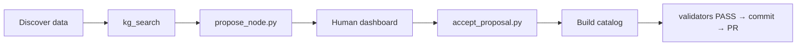

# W6 — Workshop slides (outline + draft)

**Created**: 2026-05-31  
**Format**: Half-day 09:00–13:00 · ~45 min slides + ~3 hr hands-on  
**Status**: **DRAFT for review** — not speaker notes final  
**Source of truth for schedule**: envistor [`06-attendee-flow.md`](../../../envistor-data/docs/research/workshop-ucgis-2026/06-attendee-flow.md)

---

## Slide deck structure (recommended: 35–40 slides)

| Section | Slides | Time | Mode |
| --- | --- | --- | --- |
| 0. Title + logistics | 1–3 | 2 min | listen |
| 1. Why we're here | 4–10 | 15 min | listen |
| 2. Reference D1 tour | 11–16 | 20 min | **lecturer demo** |
| 3. Framework stack | 17–22 | 10 min | listen |
| 4. Hands-on transition | 23–25 | 5 min | listen → type |
| 5. Block 2–4 cheat anchors | 26–32 | reference during hands-on | glance |
| 6. Wrap + PR | 33–35 | 5 min | listen |

---

## Section 0 — Title (slides 1–3)

### Slide 1 — Title
**AgentLoom × Cline: Building FAIR Geospatial Catalogs with Human-in-the-Loop KG**  
UCGIS 2026 Pre-Symposium Workshop · June 15, 2026 · Keven Guan, FIU GIS Center

### Slide 2 — Logistics
- Wi-Fi, power strips, Slack/QR for help  
- GitHub account required  
- API keys at Block 0 (not email)  
- Repo: `Keven1894/ucgis-agentloom-2026-workshop` (fork, don't clone organizer URL for PRs)

### Slide 3 — What you'll leave with
> A validators-green catalog in **your fork**, domain KG nodes **you** proposed and accepted, and an **open PR**.

---

## Section 1 — Why we're here (slides 4–10)

### Slide 4 — The promise of LLM-assisted dev
"Describe the app → get working code."  
Works until: session 2, new teammate, new data source, production audit.

### Slide 5 — Five failure modes (quick hits)
1. Cross-session amnesia  
2. Instruction dilution (100-rule `.clinerules`)  
3. No audit trail for "why we did X"  
4. Probabilistic compliance (model forgets)  
5. Vendor lock-in (rules don't port)

### Slide 6 — Naked Cline can build WebGIS
**Honest framing**: Cline + GPT-5.2 can ship Leaflet catalogs today.  
We are not selling "AI can code." We are selling **infrastructure around** the agent.

### Slide 7 — AgentLoom's four deltas (headline = D1)
| Delta | One line |
| --- | --- |
| **D1** | Skills = **Python scripts**, not prompt paragraphs |
| **D2** | Rules **retrieved** via KG search, not dumped |
| **D3** | **Commit-time** validators (Tier A) |
| **D4** | Same `agents/` → Cline / Cursor / Claude Code |

### Slide 8 — What we do NOT claim
- ❌ Agent never violates rules  
- ❌ Every behavior has AST enforcement today  
- ❌ Deterministic end-to-end

### Slide 9 — Today's protocol


### Slide 10 — Roles
| Who | Does |
| --- | --- |
| **You** | Accept proposals, run dashboard, commit |
| **Cline** | MCP read, propose, implement catalog |
| **Validators** | Objective pass/fail |

---

## Section 2 — D1 reference tour (slides 11–16, lecturer only)

### Slide 11 — "This is the finish line"
Attendees watch — **their fork has no D1 catalog**.

### Slide 12 — 8 storytelling sections + JSON-LD
Screenshot: `starter/quake-catalog/index.html` sections + view-source Dataset block.

### Slide 13 — Dashboard audit trail
Timeline tab: UPDATE_LOG entries from May build.

### Slide 14 — Validators bite
Live demo: remove one section → `run_all.py` FAIL → restore → PASS.

### Slide 15 — Frame line
> "Your fork has the **framework**, not our catalogs. You're first."

### Slide 16 — Pick your source
D2 OpenAQ · D3 NWIS streamflow · D4 Natural Earth admin-0  
Menu: `03-data-source-menu.md`

---

## Section 3 — Stack (slides 17–22)

### Slide 17 — Locked stack
`.venv` · VS Code · Cline · MCP `agentloom-kg` · Dashboard `:8000`

### Slide 18 — MCP is read-only
Cline searches KG — never hand-edits `*-graph.json`.

### Slide 19 — MCP UI quirk
Green server, empty tool list? **Normal.** Functional test in chat ([cline#1272](https://github.com/cline/cline/issues/1272)).

### Slide 20 — Global MCP config
One JSON for all projects — **paths must match your fork**.

### Slide 21 — Dashboard
`uvicorn … --port 8000` — dedicated terminal, Windows: skip `--reload`.

### Slide 22 — Block 0 commands (copy-paste)
```bash
python -m venv .venv
.venv/Scripts/pip install -r requirements.txt
.venv/Scripts/python scripts/test_mcp_kg_tools.py
# paste API key → Cline settings
```

---

## Section 4 — Hands-on transition (slides 23–25)

### Slide 23 — Block 2: one propose-review together
Same node for whole room — muscle memory.

### Slide 24 — Block 3: your catalog (90 min)
Use [`04-attendee-prompt-pack.md`](./04-attendee-prompt-pack.md) — **Track B** autonomous propose.

### Slide 25 — Block 4: propose a behavior (optional stretch)
Tier-A/B behavior for your source's foot-gun.

---

## Section 5 — Hands-on reference slides (26–32)

### Slide 26 — Cline task hygiene
New task per major phase; paste "Do NOT read *-graph.json".

### Slide 27 — Sentinel / no-data example (D3)
-999999 is missing, not zero.

### Slide 28 — `file://` vs static server
`python -m http.server 8766` from repo root.

### Slide 29 — Validator cheat sheet
| FAIL message | Fix |
| --- | --- |
| role text too short | Expand `data-catalog-role` section |
| JSON-LD missing field | Add to `@type: Dataset` |
| timestamp not UTC-Z | Use `dist/*-normalized.iso.json` |

### Slide 30 — Stuck? Floaters
Organizers with private reference clones — won't copy solution into your fork.

### Slide 31 — Stretch goals
Second data view · builder knowledge node · extra domain proposal.

### Slide 32 — Context budget
Long single Cline tasks get slow — prefer fresh tasks per phase.

---

## Section 6 — Wrap (slides 33–35)

### Slide 33 — PR workflow
```bash
git push -u origin workshop-<handle>
# Open PR on GitHub → upstream Keven1894/ucgis-agentloom-2026-workshop
```

### Slide 34 — SoftwareX / citation
Your PR may appear in companion paper appendix (with permission).

### Slide 35 — Thank you + links
- Workshop repo  
- AgentLoom  
- Feedback QR

---

## Speaker notes (draft bullets)

**Block 1 timing**: resist diving into MCP config — that's Block 0.  
**D1 demo**: pre-start dashboard + static server so no live debugging.  
**Honesty slide (8)**: builds trust; cite W7 dress rehearsal (136 min single task → recommend multi-task).  
**Track B**: emphasize Cline must **choose** slugs from discovery — operator won't spoon-feed CLI args.

---

## Review questions for Keven

1. Show naked-Cline failure live in Block 1, or slides-only?  
2. Block 2 warm-up node: keep builder palette or switch to domain quickstart?  
3. Pooling key: demo with proxy URL on slide 22 or day-of only?  
4. Target slide count vs A5 handout duplication?

---

## Cross-links

- Attendee prompts: [`04-attendee-prompt-pack.md`](./04-attendee-prompt-pack.md)  
- Setup: [`01-setup.md`](./01-setup.md)  
- W5 keys: [`docs/plan/todo/2026-05-31-w5-api-key-pooling.md`](../plan/todo/2026-05-31-w5-api-key-pooling.md)
