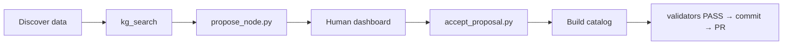

# W6 — Workshop slides (outline + draft)

**Created**: 2026-05-31 · **Reframed**: 2026-06-01  
**Format**: Half-day 09:00–13:00 · ~45 min slides + ~3 hr hands-on  
**Status**: **DRAFT** — projector deck: [`06-slides.html`](./06-slides.html) · print: [`A5-cheat-sheet.html`](./A5-cheat-sheet.html)  
**Positioning**: [`14-positioning-memory-infra-not-better-prompt.md`](../../../envistor-data/docs/research/workshop-ucgis-2026/14-positioning-memory-infra-not-better-prompt.md) — AgentLoom = memory/governance **infrastructure**, NOT "a better prompt". No naked-Cline ablation duel.  
**Source of truth for schedule**: envistor [`06-attendee-flow.md`](../../../envistor-data/docs/research/workshop-ucgis-2026/06-attendee-flow.md)

---

## Slide deck structure (recommended: 35–40 slides)

| Section | Slides | Time | Mode |
| --- | --- | --- | --- |
| 0. Title + logistics | 1–3 | 2 min | listen |
| 1. Why we're here | 4–10 | 15 min | listen |
| 2. Reference D1 tour | 11–16 | 20 min | **lecturer demo** |
| 3. Framework stack | 17–22 | 10 min | listen |
| 4. Hands-on transition | 23–25 | 5 min | listen → type |
| 5. Block 2–4 cheat anchors | 27–33 | reference during hands-on | glance |
| 6. Wrap + PR | 34–36 | 5 min | listen |

---

## Section 0 — Title (slides 1–3)

### Slide 1 — Title
**AgentLoom × Cline: Building FAIR Geospatial Catalogs with Human-in-the-Loop KG**  
UCGIS 2026 Pre-Symposium Workshop · June 15, 2026 · Keven Guan, FIU GIS Center

### Slide 2 — Logistics
- Wi-Fi, power strips, Slack/QR for help  
- GitHub account required  
- API keys at Block 0 (not email)  
- Repo: fork upstream [Keven1894/ucgis-agentloom-2026-workshop](https://github.com/Keven1894/ucgis-agentloom-2026-workshop) — clone **your** fork, not organizer’s clone URL for PRs

### Slide 3 — What you'll leave with
> A validators-green catalog in **your fork**, domain KG nodes **you** proposed and accepted, and an **open PR**.

---

## Section 1 — Why we're here (slides 4–10)

> **Narrative axis (read first)**: We do **not** stage "naked Cline vs AgentLoom on one task" — that's a false dichotomy (any single prompt can be hand-tuned to win). The argument lives on the **scale / time / multi-person** axis: a hand-written prompt has **no mechanism** for persistence, indexed retrieval, provenance, or learning. See positioning memo §2–§4.

### Slide 4 — The promise, and where it breaks
"Describe the app → get working code." Cline + GPT-5.2 **can** ship a Leaflet catalog today.  
The gap isn't capability on **one** task — it's **session 2, a teammate, a new source, an audit 3 months later.**

### Slide 5 — The real question
> It's not "can the agent do it once?" (yes).  
> It's "**where does the prompt come from, the 50th time, for the 10th person, with a traceable source?**"

A prompt is **one-shot**. The moment the session ends, the reasoning is gone.

### Slide 6 — Four things a hand-written prompt structurally cannot give
| Property | Why a "better prompt" can't fix it |
| --- | --- |
| **Persistence** across sessions | prompt dies with the session |
| **Indexed retrieval** at large N | dump-all → token blow-up + contradictions; retrieval needs an index |
| **Provenance / governance** | no audit trail, no human accept-gate |
| **Compounding (it learns)** | a mistake never crystallizes into a reusable node |

(+ portability across hosts; + a room contributing to **one** shared memory.)

### Slide 7 — So what AgentLoom actually is
> **Not a better prompt — the infrastructure that *produces* prompts reliably, at scale, with provenance, across sessions/people/hosts, and that gets better over time.**

How: KG of skills/behaviors/knowledge → MCP `kg_search` pulls only the relevant few → propose→review→accept governs every change.

### Slide 8 — What we do NOT claim (honesty slide)
- ❌ AgentLoom beats an expert's hand-tuned prompt on a single point  
- ❌ Agent never violates a rule (Tier-A validators catch, runtime is probabilistic)  
- ❌ Deterministic end-to-end  

What we DO claim: the durable properties on Slide 6 — verifiable today on the dashboard.

### Slide 9 — Today's protocol


### Slide 10 — Roles
| Who | Does |
| --- | --- |
| **You** | Accept proposals, run dashboard, commit |
| **Cline** | MCP read, propose, implement catalog |
| **Validators** | Objective pass/fail |

---

## Section 2 — D1 reference tour + the 3 evidence beats (slides 11–16, lecturer demo)

> These slides **show**, not argue. Each beat is a property from Slide 6 made visible. No win/lose comparison.

### Slide 11 — "This is the finish line"
Attendees watch — **their fork has no D1 catalog**. Open the live D1 viewer; 8 storytelling sections + view-source Schema.org Dataset JSON-LD.

### Slide 12 — Beat 1: persistence + indexed retrieval
Live: Cline calls MCP `kg_search` → returns **only the relevant few** KG nodes, not the whole store.  
Point: "This memory survived since May, and it pulls **what's relevant** — not a 100-rule dump."

### Slide 13 — Beat 2: provenance / governance
Dashboard **timeline tab**: propose→accept UPDATE_LOG chain from the May build.  
Point: "Every node has a source and a human who accepted it. A prompt has neither."

### Slide 14 — Beat 3: it learns + validators bite
- Closed loop: a past mistake became a meta-pattern node → a similar proposal now gets corrected (C4).  
- Live: remove one catalog section → `run_all.py` **FAIL** → restore → **PASS**. Objective governance, not taste.

### Slide 15 — Frame line
> "Today is not about who writes a better prompt. It's about giving your agent a memory layer that **others — and future you — can keep extending, and trace the source of.** Your fork has the framework, not our catalogs. You're first."

### Slide 16 — Pick your source
D2 OpenAQ · D3 NWIS streamflow · D4 Natural Earth admin-0  
Menu: `03-data-source-menu.md`

---

## Section 3 — Stack (slides 17–22)

### Slide 17 — Locked stack
`.venv` · VS Code · Cline · MCP `agentloom-kg` · Dashboard `:8000`

### Slide 18 — MCP is read-only
Cline searches KG — never hand-edits `*-graph.json`.

### Slide 19 — MCP UI quirk
Green server, empty tool list? **Normal.** Functional test in chat ([cline#1272](https://github.com/cline/cline/issues/1272)).

### Slide 20 — Global MCP config
One JSON for all projects — **paths must match your fork**.

### Slide 21 — Dashboard
`uvicorn … --port 8000` — dedicated terminal, Windows: skip `--reload`.

### Slide 22 — Block 0 commands (process only — no secrets on slide)
```bash
# Windows
python -m venv .venv
.venv/Scripts/pip install -r requirements.txt
.venv/Scripts/python scripts/test_mcp_kg_tools.py

# macOS/Linux
python3 -m venv .venv
.venv/bin/pip install -r requirements.txt
.venv/bin/python scripts/test_mcp_kg_tools.py

# Cline → OpenAI Compatible → Base URL + API Key: see today's A5 slip
```
Base URL and per-attendee key are **distributed day-of** (A5 slip / on-screen), never committed.

---

## Section 4 — Hands-on transition (slides 23–25)

### Slide 23 — Block 2: one propose-review together (domain quickstart)
Whole room runs the **domain quickstart** loop ([`02-quickstart.md`](./02-quickstart.md)): Cline discovers via MCP → proposes → you accept on dashboard. Builds the exact muscle memory used in Block 3 / Track B.

### Slide 24 — Block 3: your catalog (90 min)
Use [`04-attendee-prompt-pack.md`](./04-attendee-prompt-pack.md) — **Track B** autonomous propose.

### Slide 25 — D3 three-act finish (D3 only)
| Act | Snapshot / focus | KG |
| --- | --- | --- |
| Phase 5 wire | Suwannee → **1** marker | schema foot-guns (Phase 2–3) |
| Phase 5b enrich | FL stations → **6** markers | **same rules** |
| Phase 5c polish | At-a-glance narrative | **new node**: four viewer questions |

> Validators green ≠ a stranger understands the page. Capture the rule in KG, then polish.

### Slide 26 — Block 4: propose a behavior (optional stretch)
Tier-A/B behavior for your source's foot-gun.

---

## Section 5 — Hands-on reference slides (27–33)

### Slide 27 — Cline task hygiene
New task per major phase; paste "Do NOT read *-graph.json".

### Slide 28 — Sentinel / no-data example (D3)
-999999 is missing, not zero.

### Slide 29 — `file://` vs static server
`python -m http.server 8766` from repo root.

### Slide 30 — Validator cheat sheet
| FAIL message | Fix |
| --- | --- |
| role text too short | Expand `data-catalog-role` section |
| JSON-LD missing field | Add to `@type: Dataset` |
| timestamp not UTC-Z | Use `dist/*-normalized.iso.json` |

### Slide 31 — Stuck? Floaters
Organizers with private reference clones — won't copy solution into your fork.

### Slide 32 — Stretch goals
Second data view · builder knowledge node · extra domain proposal.

### Slide 33 — Context budget
Long single Cline tasks get slow — prefer fresh tasks per phase.

---

## Section 6 — Wrap (slides 34–36)

### Slide 34 — PR workflow
```bash
git push -u origin workshop-<handle>
# Open PR → https://github.com/Keven1894/ucgis-agentloom-2026-workshop
```

### Slide 35 — SoftwareX / citation
Your PR may appear in companion paper appendix (with permission).

### Slide 36 — Thank you + links
- Workshop: https://github.com/Keven1894/ucgis-agentloom-2026-workshop  
- AgentLoom: https://github.com/Keven1894/AgentLoom  
- Feedback QR

---

## Speaker notes (draft bullets)

**Narrative discipline**: never frame any single demo as "AgentLoom vs a prompt." Every Block-1 beat is a **property shown**, not a duel won. (Positioning memo §2.)  
**Block 1 timing**: resist diving into MCP config — that's Block 0.  
**D1 demo**: pre-start dashboard + static server so no live debugging.  
**Honesty slide (8)**: builds trust; cite W7 dress rehearsal (136 min single task → recommend multi-task).  
**Track B**: emphasize Cline must **choose** slugs from discovery — operator won't spoon-feed CLI args.

---

## Decisions applied (2026-06-01, from positioning memo §9)

1. **Naked-Cline ablation demo → CUT.** Block 1 shows 3 evidence beats (persistence/indexing, provenance, learning) + validator-bites. No win/lose duel.
2. **Block 2 warm-up → domain quickstart** (not builder palette) — exercises MCP retrieval + propose + audit, consistent with Track B / Block 3.
3. **Pooling key → process only on slide 22**; Base URL + per-attendee key live on the **day-of A5 slip**, never in the committed deck.
4. **Slides vs A5**: PPT ~20 "talk" slides (story + demo); commands + troubleshooting + Track B prompts live in the **A5 / QR**, not duplicated on slides.

### Still open (lower-stakes)
- Indexed retrieval at scale: **cite IR/RAG prior art** in talk (30 s), not a live benchmark — see positioning memo §8.

---

## Cross-links

- Attendee prompts: [`04-attendee-prompt-pack.md`](./04-attendee-prompt-pack.md)  
- Setup: [`01-setup.md`](./01-setup.md)  
- W5 keys: [`docs/plan/todo/2026-05-31-w5-api-key-pooling.md`](../plan/todo/2026-05-31-w5-api-key-pooling.md)
