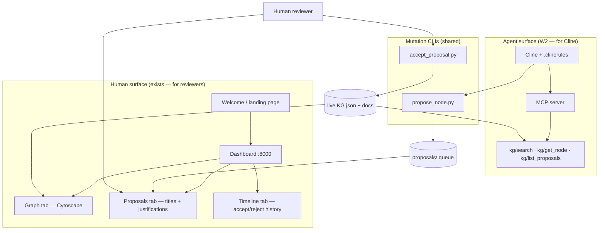

# KG access and human review — two surfaces, one protocol

**Last updated**: 2026-05-31  
**Audience**: operators, workshop doc authors, non-technical reviewers  
**Status**: architecture locked; W2 implements the agent surface + welcome onboarding  
**Related**: `docs/workshop/cline-wrapper.md` (W1), `docs/plan/todo/2026-05-31-w2-mcp-and-human-review.md`

## The confusion we are fixing

Workshop planning sometimes collapses three different jobs into one phrase — "build the KG":

| Job | Who does it | W1 status |
|---|---|---|
| **Agent proposes** candidate nodes from data evidence | Cline / builder-agent CLI | ✅ W1 — Cline wrapper verified (Wave C Tier 1) |
| **Human reviews** proposals before they enter the live KG | Instructor / attendee / mentor | ⚠️ gap — raw JSON in `proposals/` is not review-friendly |
| **KG grows** after human accept | `accept_proposal.py` + git | ✅ protocol exists since Phase 1 Day 3 |

**W1 did not "build the KG."** W1 made Cline a valid Layer-3 host that can **file proposals** into the queue. Wave C's five Natural Earth proposals are still **pending** — they were never accepted, so the domain graph did not change.

Non-technical reviewers cannot meaningfully audit proposals by opening JSON files. The next workshop milestone (W2) closes the **agent access** gap; the **human review** gap is mostly closed already by the dashboard — we need to wire attendees to it.

---

## Who builds what (infrastructure vs validation)

Workshop work splits into **framework infrastructure** (base package) and **Layer-3 host validation** (does Cline work for attendees?). Do not assign both to the same host without reason.

| Layer | Examples | Who builds / maintains | Who validates |
|---|---|---|---|
| **Framework infrastructure** (base package) | `propose_node.py`, validators, dashboard, `sync_clinerules.py`, **W2 MCP server**, welcome HTML, `.vscode/mcp.json` | **Operator + Cursor** on `feature/builder-agent` | Unit/smoke tests; operators review PRs |
| **Layer-3 wrapper** (host glue) | `.clinerules/` (W1) | Operator + Cursor (same trunk) | **Cline** smoke test (W1 Wave C ✅) |
| **Attendee / domain workflow** | Propose domain KG from D1–D4 snapshot; build catalog UI | **Attendee + Cline** at workshop | Human review on dashboard; `accept_proposal.py` |

**W2 specifically:**

- **Implement** MCP + welcome + wiring → **Cursor + operator** (same category as dashboard and validators — repo engineering on the trunk branch).
- **Accept** W2 as workshop-ready → **Cline** runs an MCP-only smoke test (mirror W1 Wave C: D4-style task, no direct `*-graph.json` reads).
- **Use** at workshop → **attendees + Cline** (MCP for search, dashboard for human review).

Optional dogfood: paste parts of W2 (e.g. welcome HTML) into Cline — not required for deadline; trunk infra stays Cursor/operator for speed and stability.

---

## Two surfaces, one protocol



| Surface | Primary user | Transport | Read or write? |
|---|---|---|---|
| **MCP server** | Cline (agent) | stdio / VS Code MCP config | **Read** KG + list proposals |
| **Dashboard** | Humans (instructor, attendee, mentor) | browser `http://127.0.0.1:8000` | **Read-only** — Graph / Proposals / Timeline |
| **Welcome page** | Humans on first boot | static HTML linked from MCP or dashboard root | **Read** — orients both surfaces |
| **`propose_node.py`** | Agent (via Cline shell) | CLI | **Write** — files proposal only |
| **`accept_proposal.py`** | Human only | CLI | **Write** — merges into live KG |

**Deliberate split**: the dashboard does **not** accept or reject proposals in the browser. Accept stays on the CLI so agents cannot self-approve (discipline D8 in `.clinerules/03-workshop-discipline.md`).

---

## What already exists (do not rebuild)

### Dashboard MVP (Phase 1 Day 3)

```bash
make dashboard    # → http://127.0.0.1:8000
```

Implementation: `server/dashboard/app.py` + `server/dashboard/static/index.html`.

| Tab | What a non-technical reviewer sees |
|---|---|
| **Graph** | Node graph — builder vs domain color-coded; click for title, description, path |
| **Proposals** | Pending queue — human-readable titles, justifications, matched UPDATE_LOG snippets |
| **Timeline** | Chronological accept/reject history — the workshop "audit trail" demo |

Wave C proposals (2026-05-31) appear on the **Proposals** tab after `make dashboard` — no JSON spelunking required.

### Propose-review CLIs

- `scripts/kg/propose_node.py` — agent files candidates
- `scripts/kg/accept_proposal.py` — human merges accepted nodes

---

## What W2 adds (agent surface + onboarding)

W2 is **not** "build visualization from scratch." W2 delivers:

### 1 — MCP server (`scripts/mcp_kg_server.py`)

Tools (minimum):

| Tool | Purpose |
|---|---|
| `kg/search` | keyword search over node titles, descriptions, markdown bodies |
| `kg/get_node` | fetch one node by id + linked markdown |
| `kg/list_proposals` | pending proposal queue (same data as dashboard Proposals tab) |

Success criterion (from workshop track): from Cline, `kg/search "iso 3166"` returns relevant nodes without loading all six `*-graph.json` files into context.

### 2 — Cline MCP wiring

- `.vscode/mcp.json` (or Cline-native MCP config) — attendees paste once or repo ships it
- `docs/workshop/cline-mcp-tools.md` — tool reference for instructors

### 3 — Welcome / landing HTML page

Served as static content (options, pick one in W2 implementation):

- **Option A**: root of MCP server (`GET /` on a small HTTP sidecar) — "Agent tools + human review links"
- **Option B**: dashboard root enhancement — banner linking Proposals tab + MCP setup status
- **Option C**: standalone `docs/workshop/welcome.html` opened locally

Minimum content:

1. "You have two windows open today" — Cline (left) + browser dashboard (review)
2. One-click link to `http://127.0.0.1:8000` Proposals tab
3. MCP tool cheat sheet (3 tools)
4. Reminder: **you** run `accept_proposal.py`, not Cline

### 4 — Dashboard polish (optional W2 stretch)

Only if time permits — not blocking W2 close:

- Highlight **new since last refresh** proposals
- Deep-link from proposal row to Graph preview of parent node
- "Open in browser" button from welcome page with tab query param

---

## Typical workshop loop (Blocks 2–3)

1. Attendee asks Cline to propose domain knowledge for their snapshot.
2. Cline uses **MCP** (`kg/search`, `kg/get_node`) to avoid duplicate nodes and retrieve builder conventions.
3. Cline shells out to **`propose_node.py`** — proposal lands in `proposals/`.
4. Attendee opens **dashboard → Proposals tab** — reads title + justification in plain language.
5. Attendee (or instructor) runs **`accept_proposal.py`** in terminal if satisfied.
6. **Graph + Timeline tabs** update — visible proof the KG grew.

Block 2 of the half-day workshop (`06-attendee-flow.md`) already assumes steps 4–6 on the dashboard. W2 makes step 2 reliable at scale.

---

## W1 vs W2 — responsibility boundary

| Concern | Owner milestone |
|---|---|
| Same system prompt across hosts | W1 ✅ `.clinerules/` + sync + drift validator |
| Cline calls `propose_node.py` correctly | W1 ✅ Wave C Tier 1 |
| Cline searches KG without slurping json | W2 ⬜ MCP |
| Human reviews without reading json | **Dashboard ✅** + welcome page ⬜ W2 |
| Attendee onboarding (both surfaces) | W4 docs (after W2+W3) |

---

## File map (after W2)

```
.clinerules/                          # W1 — agent instructions
scripts/mcp_kg_server.py              # W2 — MCP tools
scripts/kg/propose_node.py            # agent write path
scripts/kg/accept_proposal.py         # human write path
server/dashboard/                     # human read path (exists)
docs/workshop/
├── 00-workshop-workflow.md           # A→G checklist (W4 seed)
├── cline-wrapper.md                  # W1 attendee — Cline setup
├── kg-access-and-human-review.md     # this doc — architecture
├── cline-mcp-tools.md                # W2 — .venv + MCP config
├── cline-mcp-settings.example.json   # MCP template (REPO_ROOT/.venv)
├── welcome.html                      # W2 — landing page
.vscode/settings.json.example         # default interpreter = .venv
```

---

## Cross-links

- Operator Cline setup: `envistor-data/docs/research/workshop-ucgis-2026/09-cline-setup.md`
- Wave C evidence: `docs/research/agent-eval/2026-05-31-d4-from-cline-wave-c.md`
- Half-day attendee flow: `envistor-data/docs/research/workshop-ucgis-2026/06-attendee-flow.md`
- W2 execution plan: `docs/plan/todo/2026-05-31-w2-mcp-and-human-review.md`
